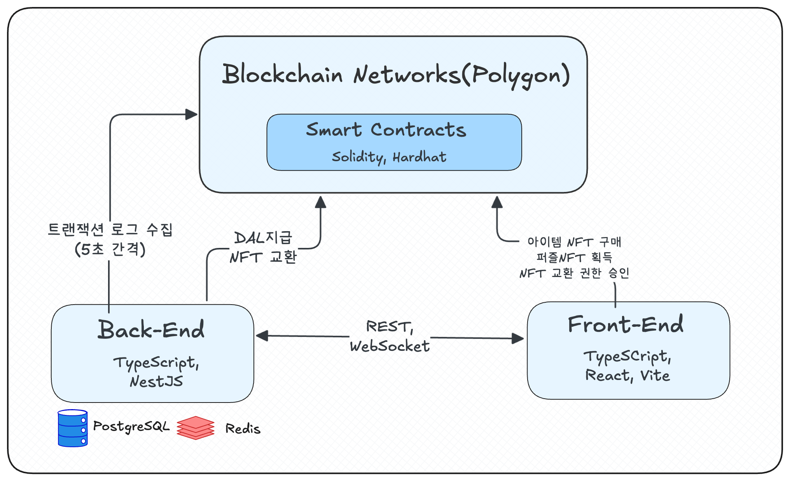
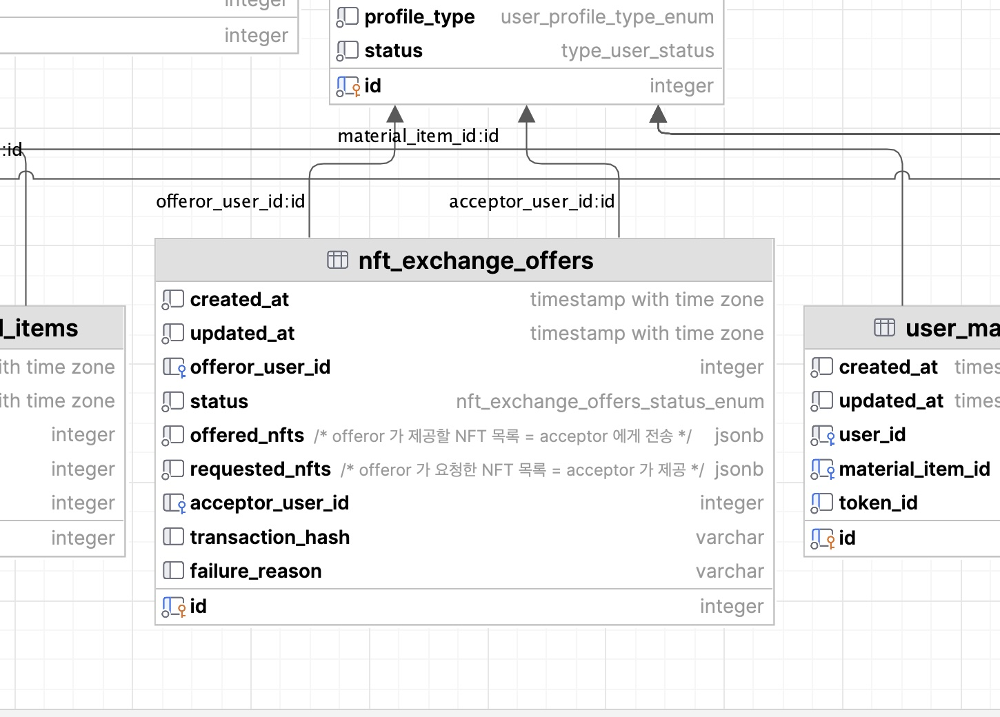

# Duzzle (더즐)

블록체인 기반 캠퍼스 NFT 퍼즐 플랫폼

## Overview

학교 건축물을 NFT 퍼즐로 만들어 사용자들이 함께 완성하는 Web3 플랫폼입니다.
Web3Auth 소셜 로그인으로 암호화폐 지갑 없이도 NFT를 경험할 수 있습니다.

**Links**: [Demo](https://try-duzzle.com) | [Backend](https://github.com/Duksung-Kkureogi/duzzle-be) | [Frontend](https://github.com/Duksung-Kkureogi/duzzle_fe) | [Contracts](https://github.com/Duksung-Kkureogi/duzzle-contract)

<details>
<summary>📌 데모 버전 안내</summary>

현재 데모는 프론트엔드 전용 버전입니다.
- **배경**: 실제 서비스는 RPC 비용 이슈로 중단
- **특징**: 백엔드/블록체인 통신 제거, 가상 데이터로 핵심 기능 체험 가능
- **원본 코드**: 완전한 구현은 GitHub 리포지토리에서 확인

</details>

## Tech Stack

- **Smart Contract**: Solidity 0.8.24, Hardhat, OpenZeppelin
- **Blockchain**: Polygon Amoy Testnet
- **Backend**: TypeScript, NestJS, TypeORM, Socket.io
- **Database**: PostgreSQL, Redis
- **Frontend**: React, Vite, Web3Auth
- **Infrastructure**: DigitalOcean Droplet, AWS S3, GitHub Actions

## Architecture

### Service Architecture
<div align="center">
  
</div>

### Contract Structure
<div align="center">
  
</div>

## Key Features

### 1. Web3 온보딩 간소화
Web3Auth 소셜 로그인으로 지갑 생성/관리 과정 제거

### 2. 가스비 절감 NFT 거래
- 사용자는 approve만, 실제 거래는 백엔드가 실행하여 사용자 경험 향상

### 3. 시즌제 NFT 발행 시스템
- 시즌별 제한된 수량 발행으로 희소성 보장, offset으로 tokenId 충돌 방지
- 재료 아이템 maxSupply: 아이템별 발행 제한으로 인플레이션 방지
- 이전 시즌 아이템 재사용

### 4. 실시간 협업 퍼즐 게임
WebSocket 기반 실시간 미니게임과 퍼즐 완성 현황 공유

## Technical Implementation

### Smart Contracts

#### 컨트랙트 구성
- **PlayDuzzle.sol**: 게임 로직, 시즌 관리, 아이템 발행
- **NFTSwap.sol**: P2P NFT 거래 시스템
- **Dal.sol**: ERC-20 게임 화폐
- **MaterialItem.sol, BlueprintItem.sol, PuzzlePiece.sol**: ERC-721 NFT


### NFT P2P 교환 시스템
- 사용자는 appove만 수행, 백엔드가 BACKEND_ROLE 권한으로 실제 거래 실행
- 거래 시점 NFT 잔액 재검증
    - 제안자 NFT 부족시 SYSTEM_CANCELLED 처리
    - 수락자 NFT 부족시 MATCHED -> LISTED 롤백
- Entity -> Contract 파라미터 매핑(NftExchangeMappingService)

#### NFT 교환 상태 다이어그램


#### 구현 화면


### Backend

#### 4개 RPC 제공자를 시간대별로 순환하여 무료 한도 내에서 운영
```typescript
// backend/src/module/scheduler/transaction-collection.scheduler.service.ts

// UTC 시간대별로 RPC 제공자 자동 전환
@Cron('*/5 * 0-5 * * *', { timeZone: 'UTC' })
async collectBlockchainTransaction_0() {
    await this._collectBlockchainTransaction(RPCProvider.INFURA);
}

@Cron('*/5 * 6-11 * * *', { timeZone: 'UTC' })
async collectBlockchainTransaction_1() {
    await this._collectBlockchainTransaction(RPCProvider.DRPC);
}

// 제공자별 API 제한 관리
const ApiRequestLimits = {
    [RPCProvider.INFURA]: { rps: 10, maxBlockRange: 10_000 },
    [RPCProvider.DRPC]: { rps: 1, maxBlockRange: 10_000 },
    [RPCProvider.ANKR]: { rps: 25, maxBlockRange: 3_000 },
    [RPCProvider.CHAINSTACK]: { rps: 20, maxBlockRange: 100 }
};
```

#### 시간 제한 미니게임으로 DAL 토큰 획득
```typescript
// backend/src/module/quest/quest.service.ts
async getResult(userId: number | null, params: GetResultRequest): Promise<boolean> {
    // 시간 제한 내 정답 확인
    const isSucceeded = 
        dayjs().isBefore(
            dayjs(log.createdAt).add(quest.timeLimit * 1000 + latency)
        ) && quest.answer === answer.join(',');
    
    // 성공시 DAL 토큰 보상
    if (isSucceeded && !log.isGuestUser) {
        await this.smartContractInteraction.mintDalToken(
            user.walletAddress,
            QuestTokenReward
        );
    }
}
```

#### 5초 간격으로 온체인 이벤트를 DB에 반영
```typescript
// backend/src/module/blockchain/blockchain.transaction.service.ts
async syncAllNftOwnersOfLogs(logs: Partial<LogTransactionEntity>[]) {
    // NFT 소유권 변경 DB 반영
    await Promise.all([
        ...puzzlePieceMintedLogs.map(e =>
            this.puzzleRepositoryService.updateOwner(e.tokenId, e.to)
        ),
        ...blueprintMintedLogs.map(e =>
            this.itemRepositoryService.updateBlueprintOwner(e.tokenId, e.to)
        ),
        ...materialMintedLogs.map(e =>
            this.itemRepositoryService.upsertMaterialOwner(e.tokenId, e.to, e.contractAddress)
        )
    ]);
}
```

### Database

#### ERD
<details>
<summary> 전체 ERD 보기 (클릭시 확장) </summary>

<div align="center">
<a href="./duzzle_erd.png" target="_blank">
  
</a>
</div>

</details>


## Smart Contract Testing

Hardhat과 TypeScript로 작성된 테스트 코드로 스마트 컨트랙트 검증

### 주요 테스트 파일

**PlayDuzzle.test.ts**
- 랜덤 아이템 획득 로직 검증
- DAL 토큰 차감 및 NFT 발행 확인
- 퍼즐 조각 잠금해제 시 필요 재료 소각 검증
- 최대 발행량 초과시 SoldOutItems 에러 처리

**PlayDuzzle-second-season.test.ts**
- 시즌 전환 시 offset 증가 확인
- 이전 시즌 재료 아이템 재사용 가능 검증
- 시즌별 독립적인 tokenId 관리

**PlayDuzzleInitialization.test.ts**
- startSeason() 권한 검증 (onlyOwner)
- setZoneData() 20개 구역 설정 확인
- 시즌 데이터 저장 검증

```typescript
// test/PlayDuzzle.test.ts 예시
it("get puzzle piece nft burning required items", async function () {
    // 필요한 재료 민팅
    await _.playDuzzleInstance!.connect(addr1).getRandomItem();
    
    // 퍼즐 조각 잠금해제 (재료 소각)
    await _.playDuzzleInstance!.connect(addr1).unlockPuzzlePiece(3);
    
    // 소유권 확인
    expect(await _.puzzlePieceInstance!.ownerOf(4)).to.equal(addr1.address);
});
```
