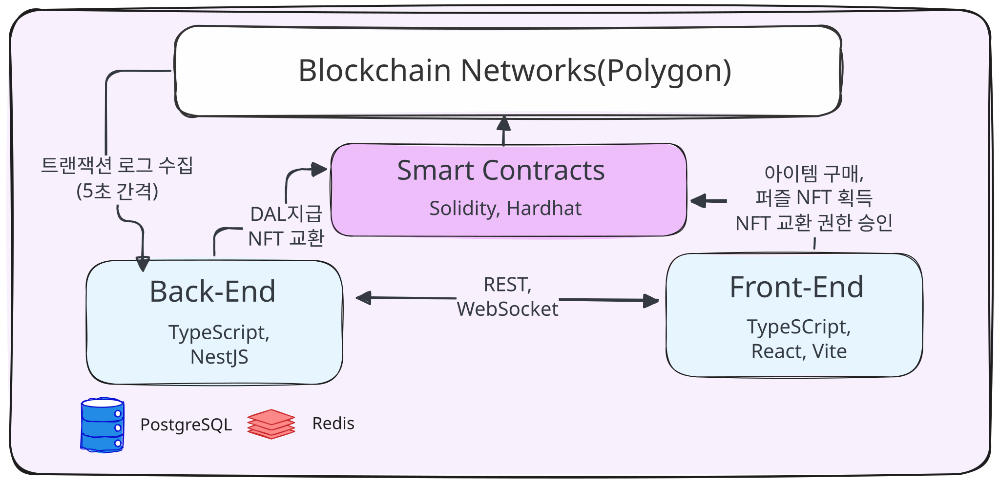
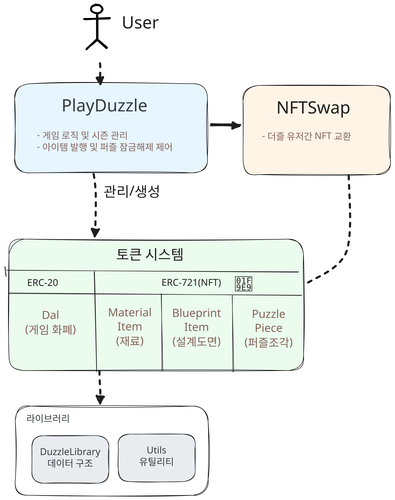

# Duzzle(더즐)
: 블록체인 기반 캠퍼스 NFT 굿즈 플랫폼

## 🚀 Quick Start
- 🌐 **체험하기**: [try-duzzle.com](http://try-duzzle.com) - 데모 버전 체험
- 📚 **소스코드**: [Backend](https://github.com/Duksung-Kkureogi/duzzle-be) | [Frontend](https://github.com/Duksung-Kkureogi/duzzle_fe.git) | [Smart Contracts](https://github.com/Duksung-Kkureogi/duzzle-contract.git)
- ⚠️ **참고**: 원본 코드는 환경설정 없이는 실행할 수 없습니다 ([자세한 설명](#데모-버전-안내))

## 📋 프로젝트 상태
- ✅ **데모 버전**: 프론트엔드만으로 핵심 기능 체험 가능
- ⏸️ **실제 서비스**: 인프라 비용 이슈로 일시 중단
- 📖 **코드 참고용**: 완전한 구현 코드는 원본 리포지토리에서 확인

## Table of Contents
- [Duzzle(더즐)](#duzzle더즐)
  - [🚀 Quick Start](#-quick-start)
  - [📋 프로젝트 상태](#-프로젝트-상태)
  - [Table of Contents](#table-of-contents)
  - [데모 버전 안내](#데모-버전-안내)
    - [⚠️ 이 브랜치는 서비스 이해를 돕기 위한 데모 버전입니다.](#️-이-브랜치는-서비스-이해를-돕기-위한-데모-버전입니다)
  - [문제 정의](#문제-정의)
      - [문제점](#문제점)
      - [해결책](#해결책)
  - [프로젝트 소개](#프로젝트-소개)
  - [장점 \& 기대효과](#장점--기대효과)
  - [기술 스택](#기술-스택)
  - [서비스 아키텍처](#서비스-아키텍처)
  - [스마트 컨트랙트](#스마트-컨트랙트)
    - [권한 관리 시스템](#권한-관리-시스템)
    - [컨트랙트 구조](#컨트랙트-구조)
    - [컨트랙트 기능](#컨트랙트-기능)
    - [배포 및 테스트 예시](#배포-및-테스트-예시)
  - [ERD](#erd)

## 데모 버전 안내

### ⚠️ 이 브랜치는 서비스 이해를 돕기 위한 데모 버전입니다.

**배경:**
- 실제 블록체인 서비스는 인프라 및 RPC 비용 이슈로 인해 현재 중단된 상태
- 이 데모는 서비스의 핵심 기능과 사용자 경험을 보여주기 위해 제작됨

**주요 특징:**
- 백엔드와 블록체인 통신이 제거된 프론트엔드 전용 버전
- 암호화폐 지갑 연동 로그인 생략 (자동 로그인 상태로 유지)
- 백엔드 API, WebSocket 통신 생략
- `axios`, `web3auth` 등의 외부 의존성 제거
- 블록체인 관련 데이터(ERC20/ERC721 토큰 보유 현황, 거래 기록 등)는 가상 데이터로 대체
- 퀘스트 시스템 수정: 원본의 백엔드 기반 랜덤 퀘스트 할당 대신, 사용자가 직접 퀘스트를 선택할 수 있는 버튼 방식으로 변경
- ERC20 토큰 보상 지급 과정 생략
- 로그아웃 기능 비활성화 (항상 로그인 상태 유지)
- ERC721 토큰(NFT)에 대한 소유권 이전 생략
  - 퍼즐 조각 NFT 발행, 조각/아이템 NFT 거래

## 문제 정의
#### 문제점
- 기존 굿즈의 무단 복제, 유실, 변조
- 디지털 굿즈의 소유권 불명확
- Web3 진입 장벽

#### 해결책
- 블록체인 기반 NFT로 희소성과 소유권 보장
  - 시즌 시작시 최대 발행량을 블록체인에 기록
- 소셜 로그인으로 Web3 진입 장벽 해소
- 게임화를 통한 자연스러운 학습 경험

## 프로젝트 소개
모든 유저가 함께 **캠퍼스 NFT 퍼즐**을 완성하며 잠금 해제(Minting) 현황을 실시간으로 공유
- 별도로 암호화폐 지갑을 생성하고 관리할 필요없이 **소셜로그인** 지원(가입 축하 메일 발송)
- 웹소켓 기반 미니게임을 통해 🌙 ***DAL 토큰***`(ERC-20)` 을 획득
- 상점에서 **랜덤** 재료 ***아이템 NFT*** 구입(2 DAL 소각) 
- 아이템을 모아서 ***퍼즐 NFT*** 잠금해제 🔓 🎉
- `거래`: 필요한 아이템은 다른 유저와 교환 🤝
- `스토리`: 미니게임이 어렵다면 스토리로 학습
- 누가누가 많이 얻었는지 `랭킹`을 통해 확인
- `마이페이지`에서 보유 NFT 조회
- 지나간 시즌의 퍼즐과 랭킹은 `히스토리`에서 조회
- `1:1 문의`에서 간편하게 관리자에게 문의 내용 남기기

## 장점 & 기대효과

1) **쉽고 재미있는 Web3 온보딩**
   - 애플리케이션 설치 없이 모바일, PC 등 웹브라우저로 서비스 이용
   - 암호화폐 지갑 생성 및 관리과정 불필요(`Web3Auth` 사용)
   - 앱 기능 구조 단순화으로 조작 부담감 감소

2) **학교 관련 정보 제공 및 가이드 역할 수행**
   - 퀘스트(미니게임)와 스토리를 통해 교내 건축물들의 이해를 돕고 상세한 정보 제공

3) **실시간 데이터 처리 및 투명성**
   - 5초 간격 스케줄러를 통해 NFT 퍼즐 발행 현황 업데이트
   - 블록체인 데이터를 주기적으로 DB에 동기화하여 빠른 API 응답 제공
   - RPC 호출 횟수를 줄여 비용 절감
   - 소유권 이전 과정을 추적하여 유저간 거래 내역 공개

4) **게임화를 통한 사용자 참여 유도**
   - 랜덤 미니게임, 랜덤 재료 획득
   - 퍼즐을 함께 완성하는 과정을 통한 협력, 재미 요소
   - 랭킹 시스템을 통한 경쟁 요소
   - 시즌제 운영으로 지속적인 사용자 참여 유도

5) **캠퍼스 변화 디지털 아카이빙**
   - 시즌이 거듭되고 시간이 흐르면서 달라지는 학교의 모습을 계속해서 반영
   - 사용자들이 디지털 공간에서 학교의 변화와 발전을 지속적으로 체험하고 추억
   - 졸업생들에게 모교와의 지속적인 연결고리
   - 대학의 역사를 블록체인에 기록하여 영구 보존

## 기술 스택
- **Backend**: `TypeScript`, `Node.js`, `NestJS`, `TypeORM`, `WebSocket`
- **Blockchain**: `Polygon`, `Solidity(스마트컨트랙트 작성 언어)`, `Hardhat`, `OpenZeppelin`, `TypeScript(테스트코드 작성 언어)`
- **Frontend**: `React`, `Vite`, `Web3Auth`
- **Database**: `PostgreSQL`, `Redis`
- **Cloud**: `AWS S3`, `DigitalOcean Droplet` (`GitHub Actions`)


## 서비스 아키텍처

<div align="center">

</div>

## 스마트 컨트랙트

시즌별 퍼즐의 총 조각 수, 각 조각 NFT 발행에 필요한 아이템 NFT, 각 NFT의 최대 발행 한도 등 모든 핵심 규칙이 스마트 컨트랙트에 기록됩니다. 블록체인에 저장된 이 규칙은 누구도 수정할 수 없기 때문에 게임의 공정성을 보장합니다.

- **DAL토큰과 각 NFT의 최대 발행량 제한으로 희소성 보장**
- **이벤트 로깅(모든 주요 액션은 블록체인 이벤트로 기록하여 추적 가능)**

### 권한 관리 시스템
- 시즌 관리: 관리자만 시즌 시작 및 구역 데이터 설정
- NFT 발행 제어: 각 NFT는 PlayDuzzle 컨트랙트에만 MINTER_ROLE 부여 
- NFT 교환 보안: NFTSwap은 백엔드 시스템에만 허용(BACKEND_ROLE)

### 컨트랙트 구조
- `서비스 컨트랙트`: *PlayDuzzle*, *NFTSwap*
- `erc-20`: *Dal* = 화폐로 쓰이는 토큰
- `erc-721`: *MaterialItem*, *BlueprintItem*, *PuzzlePiece*

<div align="center">

</div>

### 컨트랙트 기능

**PlayDuzzle**
- 시즌 시스템과 게임 핵심 로직을 관리
  - 각 시즌 퍼즐 조각 수를 `offset` 변수에 누적해서 토큰 ID 충돌 방지
  - [관리자만 호출]
    - `startSeason`: 새 시즌 시작(사용 아이템과 퍼즐 규칙 입력)
    - `setZoneData`: 특정 구역 조각 수와 필요한 아이템 구성
  - [누구나 호출 가능]
    - `getRandomItem`: DAL토큰사용하여 랜덤 아이템 NFT 구매
      - 남은 아이템 중에서 랜덤 지급, 모두 소진된 경우 `SoldOut` 에러
    - `unlockPuzzlePiece`: 필요한 재료와 설계도면 아이템을 소각하여 퍼즐 조각 잠금 해제

**NFTSwap**
- 백엔드에서만 호출 가능하여 유저간 안전한 NFT 교환
- 상태 기반 동시성 제어로 동시 수락 방지 (LISTED→MATCHED→PENDING→COMPLETED)
- 모든 아이템/퍼즐 NFT 들의 교환 원자성 보장
- 안전한 NFT 교환: ReentrancyGuard 및 상태 기반 동시성 제어
- Gasless Transaction: approval 로 미리 권한 부여, 가스비는 백엔드가 지불

**가스비 최적화**
- 동적 배열 크기 사전 할당으로 메모리 효율성 향상
- 스토리지 읽기/쓰기 최소화
- uint8/16/24 등 적절한 데이터 타입 사용으로 스토리지 비용 절감

**DuzzlieLibrary**
- 시즌별 퍼즐 정보
  - 구역별 조각 구성
  - 잠금해제에 필요한 재료 아이템
  - 설계도면 발행 현황

**Utils**
- 의사 랜덤(pseudo-random) 숫자를 생성
  - 블록체인 정보(타임스탬프와 prevrandao)를 시드로 활용
  - 여러 단계의 해싱(Keccak256)

### 배포 및 테스트 예시

**컨트랙트 배포**
```javascript
// PlayDuzzle 컨트랙트 배포 예시
const playDuzzleContract = await ethers.getContractFactory("PlayDuzzle");
const playDuzzleInstance = await playDuzzleContract.deploy(
  capOfDalToken,        // DAL 토큰의 최대 발행량
  bluePrintBaseUri,     // 설계도면 NFT 메타데이터 URI
  puzzlePieceBaseUri    // 퍼즐 조각 NFT 메타데이터 URI
);
```

**시즌 시작**
```javascript
// 시즌 시작 예시
await playDuzzleInstance.startSeason(
  existedItemCollections,  // 기존 재료 아이템 컨트랙트 주소 배열
  newItemNames,            // 새 재료 아이템 이름 배열
  newItemSymbols,          // 새 재료 아이템 심볼 배열
  newItemBaseUris,         // 새 재료 아이템 메타데이터 URI 배열
  maxSupplys,              // 각 재료 아이템의 최대 발행량
  totalPieceCount          // 시즌의 총 퍼즐 조각 수
);
```

**구역 데이터 설정**
```javascript
// 각 구역의 데이터 설정 예시
for (let zoneId = 0; zoneId < 20; zoneId++) {
  await playDuzzleInstance.setZoneData(
    zoneId,                      // 구역 ID (0-19)
    pieceCountOfZones[zoneId],   // 해당 구역의 퍼즐 조각 수
    requiredItemsForMinting[zoneId],  // 해당 구역 잠금해제에 필요한 재료 주소 배열
    requiredItemAmount[zoneId]        // 각 재료의 필요 수량
  );
}
```

## ERD
클릭시 전체 이미지 
<div align="center">
<a href="./duzzle_erd.png" target="_blank">
  
</a>
</div>